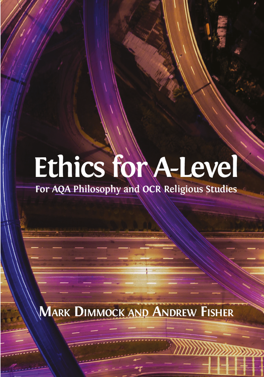

--- 
title: "Aレベルの倫理学"
site: bookdown::bookdown_site
output: bookdown::gitbook
documentclass: book
description: "Mark Dimmock と Andrew Fisherによる「Ethics for A-Level」を Better Late Than Never 氏（https://medium.com/@BetterLateThanNever）が翻訳したものを bookdown 形式で公開しているサイトです。"
---

# このサイトについて{-}

このサイトでは、オープンブックパブリッシャーズ出版のサイトで公開されている教科書“[Ethics for A-Level](https://doi.org/10.11647/OBP.0125)”を [Better Late Than Never 氏](https://medium.com/@BetterLateThanNever) が [Medium にて翻訳していたもの](https://medium.com/@BetterLateThanNever/a%E3%83%AC%E3%83%99%E3%83%AB%E3%81%AE%E5%80%AB%E7%90%86%E5%AD%A6-2f7128c1d8a9)を bookdown を使って公開しています。

当サイトのコンテンツはすべて[CC BY 4.0](https://creativecommons.org/licenses/by/4.0/deed.ja)のもとに提供されています。

当サイトの GitHub レポジトリはこちら（[https://github.com/MToyokura/Ethics-for-A-Level-Japanese](https://github.com/MToyokura/Ethics-for-A-Level-Japanese)）。

```{r, echo=FALSE, out.width='50%', fig.align = 'center', fig.link='https://doi.org/10.11647/obp.0125'}

```
Mark Dimmock and Andrew Fisher, Ethics for A-Level. Cambridge, UK: Open Book Publishers, 2017, https://doi.org/10.11647/OBP.0125
